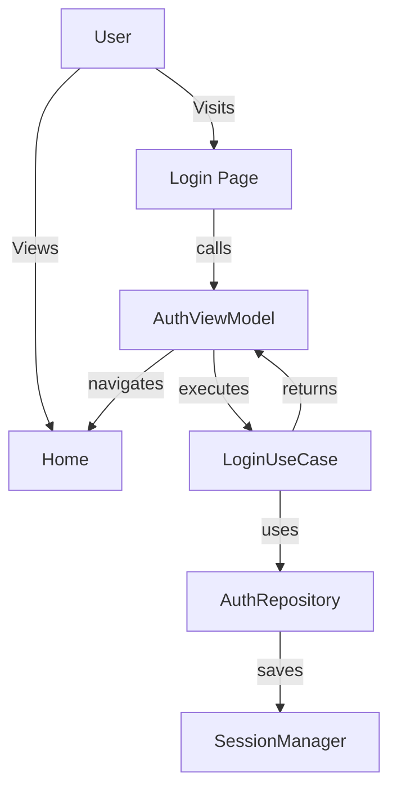
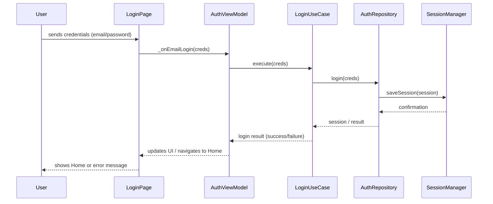

**Project: Robust Arch**

- **Description:** A Flutter project demonstrating clean architecture (domain/data/core/ui), session management, and multiple accounts (login/email/google, account switching, logout).
- **Location:** workspace root

**File Tree (tree visualization)**

```text
robust_arch/
├─ android/
├─ ios/
├─ build/
├─ lib/
│  ├─ main.dart
│  ├─ config/
│  │  ├─ app_router.dart
│  │  └─ service_locator.dart
│  ├─ core/
│  │  ├─ command.dart
│  │  ├─ failure.dart
│  │  └─ result.dart
│  ├─ domain/
│  │  ├─ entities/
│  │  │  ├─ session.dart
│  │  │  └─ auth_credentials.dart
│  │  └─ usecases/
│  ├─ data/
│  │  ├─ datasources/
│  │  └─ repositories/
│  └─ ui/
│     ├─ auth/
│     │  └─ view_model/
│     │     └─ auth_view_model.dart
│     └─ home/
│        └─ widgets/
│           └─ home_screen.dart
├─ docs/
│  └─ PROJECT_DOC.md
└─ pubspec.yaml
```

Note: the tree above is a more readable hierarchical visualization of the main directories. Items like generated files in `build/` were kept at the top to indicate their presence, but are not expanded.

**Architecture (overview)**

- **Presentation Layer (UI):** Widgets and ViewModels that display screens and react to changes; for example, `home_screen.dart` uses `AuthViewModel` for login/logout actions and session management.
- **Domain Layer (Domain):** Entities (`Session`, `AuthCredentials`), use cases responsible for application logic independent of any framework.
- **Data Layer (Data):** Data sources and repositories that implement domain contracts, model conversion, and persistence (e.g., secure storage, simulated HTTP calls).
- **Core:** Utilities and cross-cutting types such as `Command`, `Result`, and `Failure` for handling asynchronous states and errors.
- **Config:** `service_locator.dart` registers dependencies; `app_router.dart` handles routes/navigation.

**Onion Architecture Visualization**

```text
┌──────────────────────────────────────────────────────────────┐
│                                                              │
│                    ┌─ UI LAYER ─┐                           │
│                    │ Widgets    │                           │
│                    │ ViewModels │                           │
│                    └────────────┘                           │
│                                                              │
│            ┌─────── DOMAIN LAYER ──────┐                    │
│            │ Entities                  │                    │
│            │ UseCases                  │                    │
│            │ Repository Interfaces     │                    │
│            └───────────────────────────┘                    │
│                                                              │
│        ┌────────── DATA LAYER ─────────┐                    │
│        │ Repositories (impl)           │                    │
│        │ DataSources                   │                    │
│        │ Models / Mappers              │                    │
│        └───────────────────────────────┘                    │
│                                                              │
│    ┌───────── CORE / INFRASTRUCTURE ───────┐                │
│    │ Command<T>                            │                │
│    │ Result<T>                             │                │
│    │ Failure                               │                │
│    │ SessionManager (local storage)        │                │
│    └─────────────────────────────────────┘                  │
│                                                              │
│ ┌─────────────────── CONFIG ──────────────────┐             │
│ │ service_locator.dart (DI)                   │             │
│ │ app_router.dart (navigation)                │             │
│ └─────────────────────────────────────────────┘             │
│                                                              │
└──────────────────────────────────────────────────────────────┘

Dependency Flow (from outside to inside):
┌────────────┐         ┌──────────────┐         ┌─────────────┐
│ UI Layer   │────────▶│ Domain Layer │────────▶│ Core Layer  │
│  (Widgets) │         │ (UseCases)   │         │ (Utilities) │
└────────────┘         └──────────────┘         └─────────────┘
                               │
                               ▼
                        ┌──────────────┐
                        │ Data Layer   │
                        │ (Repos/DS)   │
                        └──────────────┘
```

**Onion Architecture Principles Applied:**

- **Framework Independence:** The Domain layer does not know Flutter or any external framework.
- **Testability:** Each layer can be tested in isolation through dependency injection.
- **Business Rules at the Center:** UseCases contain business logic, not the UI.
- **Centripetal Flow:** Dependencies always point to the center (Direction Rule).

**Use Case Diagram (Mermaid / Alternative Flowchart)**

> Some renderers have limited support for `usecaseDiagram`. Below is a `flowchart` version that is usually displayed correctly, followed by a detailed sequence diagram of the login flow.



**Sequence Diagram: login flow (detailed)**



**Main Flows**

- **Login / Add Account:** the user provides `EmailCredentials` (or Google); ViewModel fires `addAccountWithEmail` or `addAccountWithGoogle`, which call appropriate use cases to create/validate session.
- **Switch Account:** from the `HomeScreen` the user opens the account selector (bottom sheet) and chooses another session; the ViewModel executes `switchAccount(session)` to update the active session.
- **Logout:** button executes `logout` (a `Command`) that performs session cleanup and updates the UI with loading state.

**Main Components (where to look)**

- **Entrypoint:** [lib/main.dart](lib/main.dart)
- **Routes:** [lib/config/app_router.dart](lib/config/app_router.dart)
- **Dependency Injection:** [lib/config/service_locator.dart](lib/config/service_locator.dart)
- **Auth ViewModel:** [lib/ui/auth/view_model/auth_view_model.dart](lib/ui/auth/view_model/auth_view_model.dart)
- **Home Screen:** [lib/ui/home/widgets/home_screen.dart](lib/ui/home/widgets/home_screen.dart)

**How to Run (locally)**

1. Install dependencies: `flutter pub get`
2. Run on emulator or device: `flutter run`

**Notes and Next Suggestions**

- Include additional diagrams (layered architecture, login sequence).
- Add more extensive README with build commands and development flows.
- Unit test coverage for domain use cases.

## Screenshots


