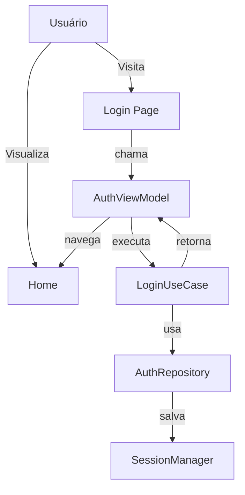
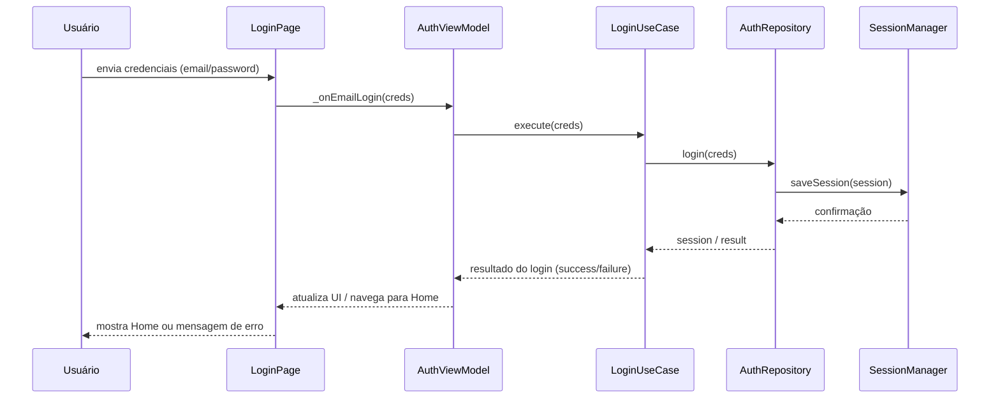
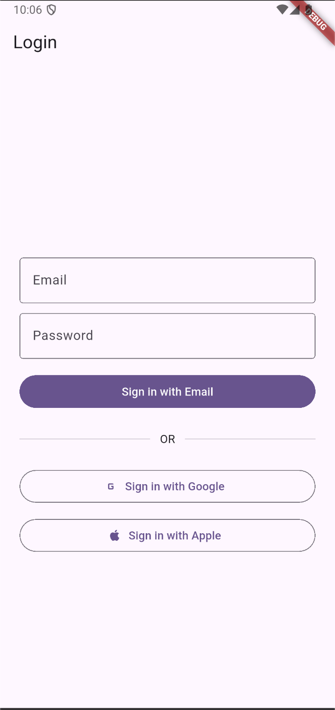
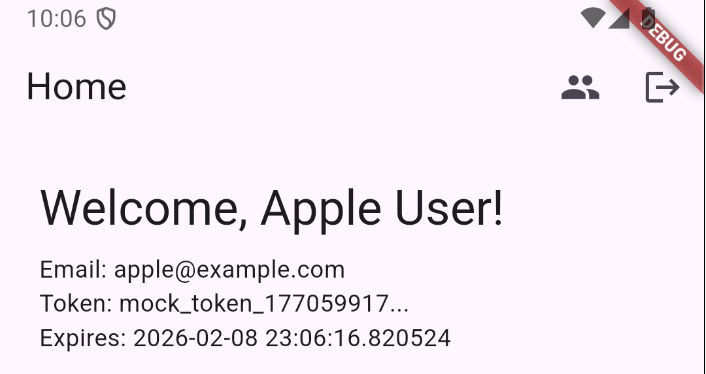
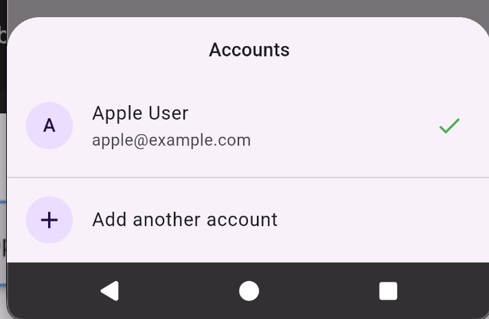
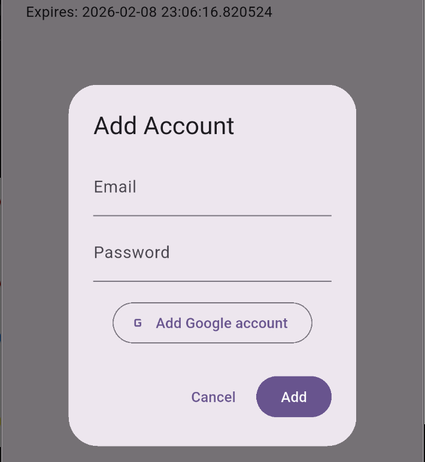
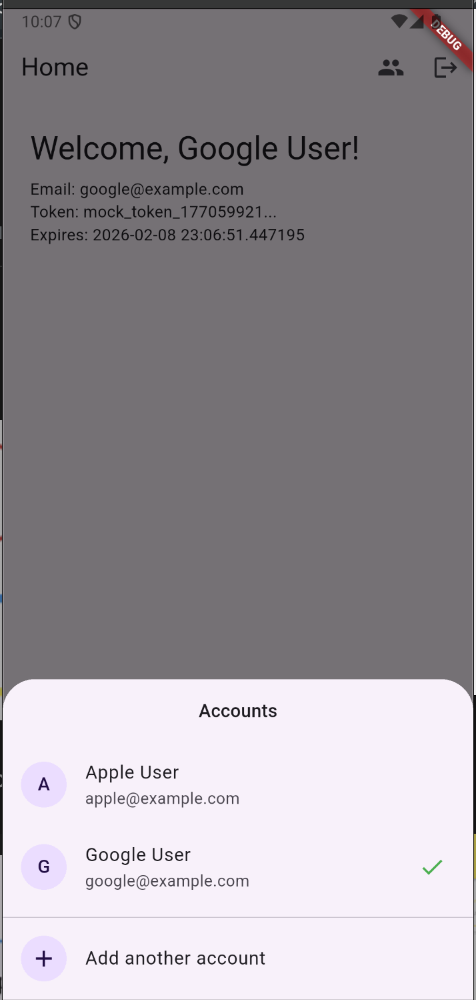

**Projeto: Robust Arch**

- **Descrição:** Projeto Flutter que demonstra uma arquitetura limpa (domain/data/core/ui), gerenciamento de sessão e múltiplas contas (login/email/google, troca de conta, logout).
- **Local:** raiz do workspace

**Árvore de Arquivos (visualização em árvore)**

```text
robust_arch/
├─ android/
├─ ios/
├─ build/
├─ lib/
│  ├─ main.dart
│  ├─ config/
│  │  ├─ app_router.dart
│  │  └─ service_locator.dart
│  ├─ core/
│  │  ├─ command.dart
│  │  ├─ failure.dart
│  │  └─ result.dart
│  ├─ domain/
│  │  ├─ entities/
│  │  │  ├─ session.dart
│  │  │  └─ auth_credentials.dart
│  │  └─ usecases/
│  ├─ data/
│  │  ├─ datasources/
│  │  └─ repositories/
│  └─ ui/
│     ├─ auth/
│     │  └─ view_model/
│     │     └─ auth_view_model.dart
│     └─ home/
│        └─ widgets/
│           └─ home_screen.dart
├─ docs/
│  └─ PROJECT_DOC.md
└─ pubspec.yaml
```

Obs: a árvore acima é uma visualização hierárquica mais legível dos diretórios principais. Itens como arquivos gerados em `build/` foram mantidos no topo para indicar presença, mas não estão expandidos.

**Arquitetura (visão geral)**

- **Camada de Apresentação (UI):** Widgets e ViewModels que exibem telas e reagem a mudanças; por exemplo `home_screen.dart` usa `AuthViewModel` para ações de login/logout e gestão de sessões.
- **Camada de Domínio (Domain):** Entidades (`Session`, `AuthCredentials`), casos de uso (usecases) responsáveis pela lógica da aplicação independente de framework.
- **Camada de Dados (Data):** Data sources e repositórios que implementam contratos de domínio, conversão de modelos e persistência (ex.: armazenamento seguro, chamadas HTTP simuladas).
- **Core:** Utilitários e tipos transversais como `Command`, `Result` e `Failure` para tratamento de estados assíncronos e erros.
- **Config:** `service_locator.dart` registra dependências; `app_router.dart` trata rotas/navegação.

**Visualização Estilo Cebola (Onion Architecture)**

```text
┌──────────────────────────────────────────────────────────────┐
│                                                              │
│                    ┌─ UI LAYER ─┐                           │
│                    │ Widgets    │                           │
│                    │ ViewModels │                           │
│                    └────────────┘                           │
│                                                              │
│            ┌─────── DOMAIN LAYER ──────┐                    │
│            │ Entities                  │                    │
│            │ UseCases                  │                    │
│            │ Repository Interfaces     │                    │
│            └───────────────────────────┘                    │
│                                                              │
│        ┌────────── DATA LAYER ─────────┐                    │
│        │ Repositories (impl)           │                    │
│        │ DataSources                   │                    │
│        │ Models / Mappers              │                    │
│        └───────────────────────────────┘                    │
│                                                              │
│    ┌───────── CORE / INFRASTRUCTURE ───────┐                │
│    │ Command<T>                            │                │
│    │ Result<T>                             │                │
│    │ Failure                               │                │
│    │ SessionManager (local storage)        │                │
│    └─────────────────────────────────────┘                  │
│                                                              │
│ ┌─────────────────── CONFIG ──────────────────┐             │
│ │ service_locator.dart (DI)                   │             │
│ │ app_router.dart (navigation)                │             │
│ └─────────────────────────────────────────────┘             │
│                                                              │
└──────────────────────────────────────────────────────────────┘

Fluxo de Dependências (de fora para dentro):
┌────────────┐         ┌──────────────┐         ┌─────────────┐
│ UI Layer   │────────▶│ Domain Layer │────────▶│ Core Layer  │
│  (Widgets) │         │ (UseCases)   │         │ (Utilities) │
└────────────┘         └──────────────┘         └─────────────┘
                               │
                               ▼
                        ┌──────────────┐
                        │ Data Layer   │
                        │ (Repos/DS)   │
                        └──────────────┘
```

**Princípios da Arquitetura Cebola aplicados:**

- **Independência de Framework:** A camada de Domain não conhece Flutter ou qualquer framework externo.
- **Testabilidade:** Cada camada pode ser testada isoladamente através de injeção de dependências.
- **Regras de Negócio no Centro:** UseCases contêm a lógica de negócio, não a UI.
- **Fluxo Centrípeto:** Dependências apontam sempre para o centro (Direction Rule).

**Diagrama de Casos de Uso (Mermaid / Flowchart alternativo)**

> Alguns renderizadores têm suporte limitado ao `usecaseDiagram`. Abaixo há uma versão em `flowchart` que costuma ser exibida corretamente, seguida por um diagrama de sequência detalhando o fluxo de login.



**Diagrama de Sequência: fluxo de login (detalhado)**



**Fluxos principais**

- **Login / Adicionar Conta:** o usuário fornece `EmailCredentials` (ou Google); ViewModel dispara `addAccountWithEmail` ou `addAccountWithGoogle`, que chamam casos de uso apropriados para criar/validar sessão.
- **Trocar Conta:** a partir do `HomeScreen` o usuário abre o seletor de contas (bottom sheet) e escolhe outra sessão; o ViewModel executa `switchAccount(session)` para atualizar a sessão ativa.
- **Logout:** botão executa `logout` (um `Command`) que realiza limpeza de sessão e atualiza a UI com estado de loading.

**Principais componentes (onde procurar)**

- **Entrypoint:** [lib/main.dart](lib/main.dart)
- **Rotas:** [lib/config/app_router.dart](lib/config/app_router.dart)
- **Injeção de dependências:** [lib/config/service_locator.dart](lib/config/service_locator.dart)
- **ViewModel Auth:** [lib/ui/auth/view_model/auth_view_model.dart](lib/ui/auth/view_model/auth_view_model.dart)
- **Tela Home:** [lib/ui/home/widgets/home_screen.dart](lib/ui/home/widgets/home_screen.dart)

**Como rodar (local)**

1. Instalar dependências: `flutter pub get`
2. Rodar no emulador ou dispositivo: `flutter run`

**Observações e próximas sugestões**

- Incluir diagramas adicionais (arquitetura em camadas, sequência de login).
- Adicionar README mais extenso com comandos de build e fluxos de desenvolvimento.
- Cobertura de testes unitários para casos de uso do domínio.

----
_Gerado automaticamente pelo assistente de projeto — se quiser, atualizo o conteúdo com mais detalhes (diagramas de sequência, arquitetura de classes ou arquivos completos)._









